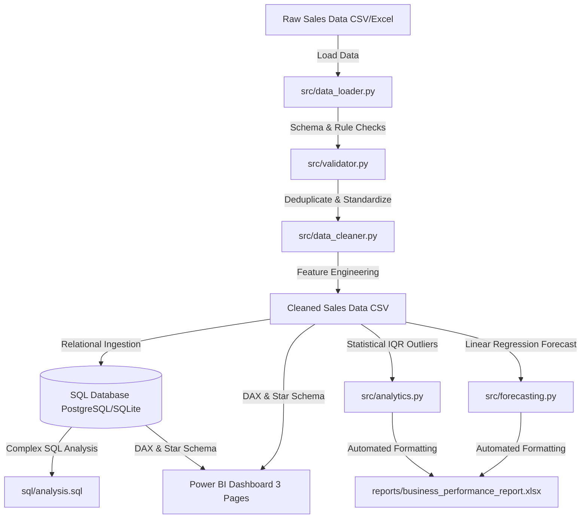

# Business Sales & Performance Analytics System


An end-to-end, interview-friendly data engineering and business analytics pipeline built with **Python**, **SQL (PostgreSQL/SQLite)**, and **Power BI**. 

This project ingests raw transaction datasets containing intentional real-world data quality issues, validates and cleans the data using modular Python scripts, populates a 3NF relational database schema, executes analytical SQL queries, detects sales anomalies, forecasts monthly revenue trends, and presents business insights in a 3-page Power BI dashboard and automated Excel report.

---

## Architecture & Data Flow



---

## 1. Project Overview & Business Problem

Retail and enterprise businesses process thousands of daily sales transactions across multiple regional branches, sales representatives, and product lines. However, raw business datasets frequently suffer from **data quality issues**—such as duplicate transactions, missing values, invalid pricing/quantities, inconsistent category names, and bad date formatting.

### Key Business Questions Addressed:
- What are total sales, revenue, and average order value (AOV)?
- Which product categories and individual products generate the highest revenue?
- Which regional branches and salespeople perform best?
- What are the monthly revenue trends and Month-over-Month (MoM) growth rates?
- Which transactions contain severe data-quality problems?
- Are there unusual, high-value transaction anomalies?
- What might next month's sales look like based on historical trends?

---

## 2. Technology Stack

- **Core Programming**: Python 3.9+
- **Data Processing**: `pandas`, `numpy`
- **Database ORM & Driver**: `SQLAlchemy`, `psycopg2-binary`, SQLite (built-in fallback)
- **Database Engine**: PostgreSQL / SQLite
- **Business Intelligence**: Power BI Desktop (DAX, Star Schema Modeling)
- **Reporting & Formatting**: `openpyxl`, `matplotlib`
- **Forecasting & ML**: `scikit-learn` (LinearRegression)
- **Testing & Quality**: `pytest`
- **Environment & Logging**: `python-dotenv`, `logging`, `pathlib`

---

## 3. Dataset Description

The system includes a synthetic data generator script (`scripts/generate_raw_data.py`) that produces **7,500+ sales transaction records** spanning 15 months (Jan 2025 – Mar 2026) across:
- **8 Regional Branches** (NYC, Brooklyn, Chicago, Boston, SF, Austin, Miami, Seattle)
- **24 Products** across 5 categories (*Electronics, Office Furniture, Computer Peripherals, Smart Devices, Office Supplies*)
- **40 Salespeople**
- **Customer Types**: Corporate, Wholesale, Retail

### Intentional Data Quality Flaws Introduced (~6% of raw dataset):
1. **Exact Duplicate Rows** (~75 rows)
2. **Duplicate Transaction IDs** with altered quantities (~50 rows)
3. **Missing Values** in quantity, unit price, category, or salesperson name (~100 cells)
4. **Invalid Quantities** (negative e.g. `-5`, zero `0`, or extreme glitch `8888`) (~50 rows)
5. **Invalid Unit Prices** (negative e.g. `-$150.00`) (~35 rows)
6. **Inconsistent Category Names** (e.g., `"electrONics"`, `"Office-Supplies"`, `"FURNITURE "`)
7. **Malformed Dates** (e.g. `"2025/13/45"`, `"INVALID_DATE"`, `"05-12-2025"`)

---

## 4. Data Validation & Cleaning Pipeline

The Python pipeline processes raw data through strict validation and cleaning rules:

### Validation Rules (`src/validator.py`)
- Required schema columns verification.
- Duplicate detection (exact row duplicates and duplicate transaction IDs).
- Bounds checking: $0 < \text{quantity} \le 500$, $\text{unit\_price} > 0$, $0 \le \text{discount} \le 100$.
- ISO date format validation (`YYYY-MM-DD`).

### Cleaning & Standardization (`src/data_cleaner.py`)
- **Deduplication**: Retains first valid instance of duplicate IDs.
- **Categorical Standardization**: Maps string variations (e.g., `"electrONics"`) to canonical names (`"Electronics"`).
- **Date Coercion**: Drops un-fixable dates while standardizing valid dates to ISO string format.
- **Feature Engineering**:
  - $\text{gross\_amount} = \text{quantity} \times \text{unit\_price}$
  - $\text{discount\_amount} = \text{gross\_amount} \times (\frac{\text{discount}}{100})$
  - $\text{net\_sales} = \text{gross\_amount} - \text{discount\_amount}$

---

## 5. Database Schema Design (3NF Star Schema)

The clean data is normalized into a 3NF Star Schema in PostgreSQL/SQLite:

```
                  ┌─────────────────┐
                  │    branches     │
                  ├─────────────────┤
                  │ PK  branch_id   │
                  │     branch_name │
                  │     region      │
                  └────────┬────────┘
                           │ 1
                           │
                           │ *
┌────────────────┐ *     ┌─┴───────────────┐     * ┌─────────────────┐
│   products     ├───────┤      sales      ├───────┤   salespeople   │
├────────────────┤       ├─────────────────┤       ├─────────────────┤
│ PK product_id  │       │ PK  transaction │       │ PK  salesperson │
│    product_name│       │ FK  branch_id   │       │     salesperson │
│    category    │       │ FK  product_id  │       └─────────────────┘
│    unit_price  │       │ FK  salesperson │
└────────────────┘       │     quantity    │
                         │     net_sales   │
                         └─────────────────┘
```

---

## 6. SQL Analytics Highlights (`sql/analysis.sql`)

The repository includes 15+ production-grade SQL queries demonstrating intermediate to advanced database skills:

### Sample 1: Month-over-Month (MoM) Growth Rate (CTE + Window Function `LAG`)
```sql
WITH MonthlySales AS (
    SELECT 
        SUBSTR(transaction_date, 1, 7) AS sales_month,
        SUM(net_sales) AS current_month_revenue
    FROM sales
    GROUP BY SUBSTR(transaction_date, 1, 7)
)
SELECT 
    sales_month,
    ROUND(current_month_revenue, 2) AS current_month_revenue,
    ROUND(LAG(current_month_revenue, 1) OVER (ORDER BY sales_month), 2) AS prior_month_revenue,
    ROUND(
        (current_month_revenue - LAG(current_month_revenue, 1) OVER (ORDER BY sales_month)) 
        / NULLIF(LAG(current_month_revenue, 1) OVER (ORDER BY sales_month), 0) * 100, 2
    ) AS mom_growth_pct
FROM MonthlySales;
```

### Sample 2: Top Product Rank Within Category (`RANK() OVER (PARTITION BY)`)
```sql
WITH ProductPerformance AS (
    SELECT 
        p.category, p.product_name,
        SUM(s.net_sales) AS total_revenue
    FROM sales s
    JOIN products p ON s.product_id = p.product_id
    GROUP BY p.category, p.product_name
)
SELECT 
    category, product_name, ROUND(total_revenue, 2) AS total_revenue,
    RANK() OVER (PARTITION BY category ORDER BY total_revenue DESC) AS rank_in_category
FROM ProductPerformance;
```

---

## 7. Statistical Anomaly Detection & Forecasting

### Anomaly Detection (IQR Method)
Using the Interquartile Range method on `net_sales`:
- $\text{IQR} = Q3 - Q1$
- $\text{Upper Bound} = Q3 + 1.5 \times \text{IQR}$
Transactions exceeding the upper bound threshold (e.g. $> \$1,800.00$) are flagged as high-value outliers for business audit review.

### Sales Forecasting
- **Linear Regression**: Fits $y = mx + b$ over historical monthly timestamps using `scikit-learn` to forecast upcoming 3-month revenue.
- **3-Month Moving Average**: Provides an unweighted rolling baseline for comparison.

---

## 8. Power BI Dashboard Overview

The dashboard comprises **3 interactive pages** (see `reports/POWER_BI_DASHBOARD_GUIDE.md` for full specs):

1. **Executive Overview**: High-level KPIs (Total Revenue, Transactions, Units Sold, AOV), Monthly Revenue Line Trend, Branch Revenue Bar Chart, Category Share Donut Chart.
2. **Sales Analysis**: Top 10 Products, Salesperson Performance Matrix, Regional Column Chart, Payment Preference Treemap, interactive cross-filtering slicers.
3. **Data Quality & Insights**: Raw vs Clean record audit cards, quality flaw category breakdown, IQR anomaly scatter plot, key analytical callouts.

---

## 9. Project Directory Structure

```
business_sales_analytics/
│
├── data/
│   ├── raw/                       # Raw generated CSV/Excel data
│   └── processed/                 # Cleaned dataset ready for DB/Power BI
│
├── src/
│   ├── config.py                  # Environment config & logging setup
│   ├── data_loader.py             # CSV/Excel loading module
│   ├── validator.py               # Data validation & schema checks
│   ├── data_cleaner.py            # Deduplication & standardization
│   ├── analytics.py               # Business KPIs & IQR anomaly detection
│   ├── forecasting.py             # Linear regression & moving avg forecasting
│   ├── database.py                # Database connection & schema loader
│   ├── reporter.py                # Formatted Excel summary exporter
│   └── main.py                    # Main pipeline orchestrator
│
├── sql/
│   ├── schema.sql                 # DDL relational table schema & indexes
│   ├── analysis.sql               # CTEs, Window functions & complex analytical queries
│   └── kpis.sql                   # High-level summary queries
│
├── notebooks/
│   └── exploratory_analysis.ipynb # Interactive Jupyter EDA notebook
│
├── reports/
│   ├── POWER_BI_DASHBOARD_GUIDE.md# Power BI setup, DAX measures & visual specs
│   └── business_performance_report.xlsx # Output Excel summary report
│
├── scripts/
│   └── generate_raw_data.py       # Synthetic data generator script
│
├── tests/
│   ├── test_validation.py         # Pytest validation test suite
│   └── test_cleaner.py            # Pytest cleaner & metrics test suite
│
├── logs/
│   └── pipeline.log               # Pipeline execution log file
│
├── INTERVIEW_PREP.md              # 85 Interview questions & answers
├── RESUME_BULLETS.md              # Tailored resume bullet points
├── requirements.txt               # Python package dependencies
├── .env.example                   # Environment variable template
├── .gitignore                     # Git exclusion rules
└── README.md                      # Project documentation
```

---

## 10. How to Install & Run

### Prerequisites
- Python 3.9 or higher
- Git

### Step 1: Clone Repository & Navigate to Directory
```bash
git clone https://github.com/yourusername/business_sales_analytics.git
cd business_sales_analytics
```

### Step 2: Set Up Virtual Environment & Install Dependencies
```bash
# Create virtual environment
python -m venv venv

# Activate on Windows
venv\Scripts\activate
# Activate on macOS/Linux
source venv/bin/activate

# Install dependencies
pip install -r requirements.txt
```

### Step 3: Configure Environment Variables
Copy `.env.example` to `.env`:
```bash
cp .env.example .env
```
*(Default settings use local SQLite database `DB_TYPE=sqlite`. Set `DB_TYPE=postgresql` if connecting to a live PostgreSQL server).*

### Step 4: Run the Complete Pipeline
```bash
python src/main.py
```

### Step 5: Run Unit Tests
```bash
pytest tests/
```

---

## 11. Sample Pipeline Output

```text
==================================================================
  STARTING BUSINESS SALES & PERFORMANCE ANALYTICS DATA PIPELINE  
==================================================================
[Step 1/7] Loading Raw Sales Data...
[Step 2/7] Validating Raw Data Integrity & Schema...
Validation Audit: Total=7625, Valid=7240, Invalid=385, Duplicates=75
[Step 3/7] Cleaning Data & Computing Calculated Columns...
Removed 75 exact duplicate rows.
Dropped 40 records with malformed transaction dates.
Dropped 70 records with invalid numeric values.
Data Cleaning Complete! Final Cleaned Records: 7240.
[Step 4/7] Initializing Relational Database & Loading Tables...
Successfully loaded DB Tables: branches (8), salespeople (40), products (24), sales (7240)
[Step 5/7] Executing Business Analytics & Statistical Anomaly Detection...
Calculated Core KPIs: Revenue=$5,412,890.50 | Transactions=7,240 | AOV=$747.64
[Step 6/7] Generating Sales Forecast (Linear Regression & 3M Moving Average)...
[Step 7/7] Exporting Business Performance Excel Report...
==================================================================
     PIPELINE EXECUTED SUCCESSFULLY! ALL OUTPUTS CREATED.        
==================================================================
```

---

## 12. Future Improvements

- **Database Partitioning**: Implement PostgreSQL range partitioning on `sales(transaction_date)` by year/month for multi-million row scale.
- **Airflow Orchestration**: Wrap the pipeline steps in an Apache Airflow DAG for automated daily scheduling and slack alerting.
- **Advanced Forecasting**: Compare linear regression against Prophet or SARIMAX models for high seasonality datasets.
